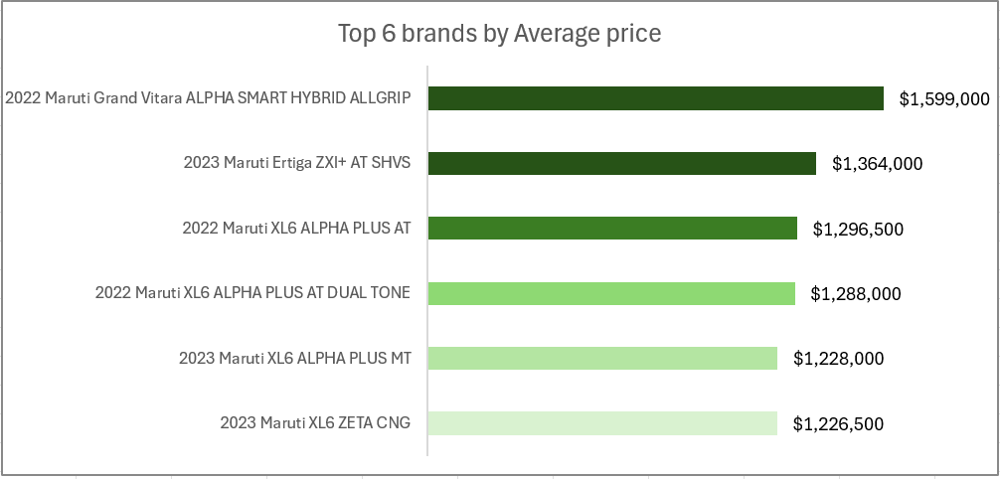

# Car-Brand-Sales-Analysis 2010 - 2023

## Introduction
This project focuses on analyzing the trends, demand, and pricing patterns in the used car market from 2010 to 2023. By leveraging key automotive attributes such as transmission, fuel type, engine capacity, and ownership history, this dashboard delivers strategic insights for both car buyers and industry stakeholders.

## Overview
The dashboard presents a comprehensive breakdown of the most influential features in the pre-owned vehicle market. It helps users understand pricing shifts, demand drivers, and attribute performance over time.
Key highlights include:
-	Most expensive car brands
-	Fuel and transmission preferences
-	Ownership impact on price
-	Ownership impact on KM Driven
-	Year-on-year pricing trends
-	Engine Preferences
-	Average price by Engine Capacity

## Problem Statement
In a dynamic automotive resale market, stakeholders struggle to:
-	Identify which car features influence resale value
-	Understand evolving consumer preferences (fuel type, transmission)
-	Predict pricing trends over time
This dashboard addresses these challenges by providing an interactive, data-driven view of the market between 2010 and 2023.

## Skills Demonstrated
-	Data Cleaning and Preprocessing (Excel, Power Query)
-	Data Analysis & Aggregation
-	Dashboard Design (Excel with slicers and charts)
-	Visualization Best Practices
-	Analytical Storytelling

## Data Source
The data was extracted from a structured Excel dataset derived from used car listings between 2010 and 2023. It includes:
-	Brand and Model
-	Price
-	Engine Capacity
-	KM Driven
-	Ownership History
-	Fuel Type
-	Transmission
-	Imperfections and Repainted Parts

## Data Cleaning & Transformation
-	Removed duplicate records and incomplete entries
-	Converted string-based numerical fields (e.g., price, km driven) into numeric types
-	Standardized transmission and fuel type categories
-	Extracted year from manufacturing dates
-	Created measures for average price, average kilometers driven, and count distributions

## Exploratory Data Analysis (EDA)
Using Excel pivot tables and charts, EDA focused on identifying:
- Pricing trends over the years
- Engine capacity impact on average price
- Ownership patterns and their relation to KM driven
- Transmission preferences
- Demand by fuel type

## Dashboard Insights
### 🔹Top 6 Brands by Average Price

- The 2022 Maruti Grand Vitara ALPHA SMART HYBRID ALLGRIP leads with ₹1,599,000.
- Followed by 2023 Ertiga ZXI+ AT SHVS and 2022 Maruti XL6 ALPHA PLUS AT, showing consistent demand for high-end variants.

### 🔹 Average Price Over Years

- The price has shown a steady upward trend from $208,000 in 2010 to $775,774 in 2023, indicating increased consumer spending and model quality over time.

### 🔹 Transmission by Number

- Manual transmission dominates (1,073 listings) over automatic (372), but automatic cars command a higher average price ($601,339 vs. $500,358).

### 🔹 Ownership by KM Driven

- Vehicles with 3 ownerships have the highest average KM driven (74,488), suggesting greater usage or older vehicles.
- Newer cars (1 ownership) have lower average KM, ideal for resale.

### 🔹 Transmission Analysis

- Automatic cars have a higher average price despite fewer listings, showing market value and possibly greater demand.
- Manual cars are more common but lower-priced, appealing to budget-conscious buyers.

🔹 Average Price by Engine Capacity

- Engine capacities between 1248cc and 1462cc attract higher prices.
- Smaller engines (e.g., 796cc) have significantly lower resale values.

🔹 Demand by Fuel Type

- Petrol cars dominate with 87% of listings.
- Diesel (8%) and CNG (5%) show lower demand, possibly due to running cost concerns or regulatory pressures.

## Recommendations
- Stock more petrol and manual cars to meet current demand trends.
- Promote automatic variants in marketing, as they yield higher prices despite lower volume.
- Target mid-range engine capacities (1248cc–1462cc) for optimal profitability.
- Highlight low-ownership vehicles in listings to appeal to quality-focused buyers.
- Monitor and forecast price trends annually to optimize pricing strategies.

## Conclusion
This dashboard effectively delivers a multi-faceted view of the car resale market over a 13-year period. It provides valuable insights for dealerships, analysts, and consumers to make informed decisions based on real market behaviors. By integrating clear visualizations and interactive filters, it serves as a powerful tool for data-driven automotive strategy.
